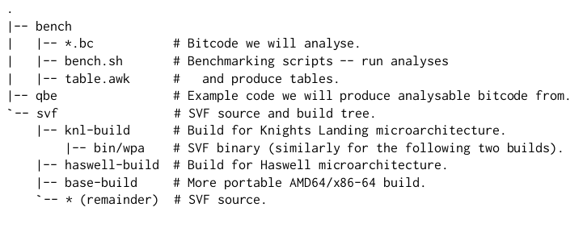
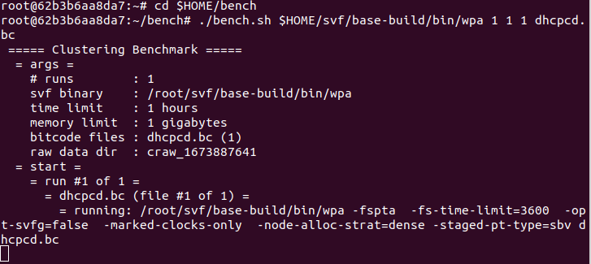

# 运行指南

## 环境需求

需要Ubuntu系统并安装docker  

（下面使用机器为Ubuntu20.04系统，16GB内存，docker版本20.10.21）

## docker容器内布局

## 如何运行

1.到[原文地址](https://zenodo.org/record/5507442#.Y_SOJzNBzJx)下载文件 compacting-points-to-sets.tar.gz  
2.使用docker运行，在文件目录下打开终端，先后运行如下指令  
(1) `docker load < compacting-points-to-sets.tar.gz`  
(2) `docker run -it compacting-points-to-sets bash`  
如图：  
.png)  
.png)  

尝试如下命令可以运行一个简单的例子：  
(1)`cd $HOME/bench`  
(2) `./bench.sh $HOME/svf/base-build/bin/wpa 1 1 1 dhcpcd.bc`  
如图开始运行  
  

指令(2)拆解：  
`./bench.sh SVF_BIN NUM_RUNS TIME_LIMIT MEM_LIMIT BITCODE...`  
SVF_BIN默认 \$HOME/svf/base-build/bin/wpa 即可  
NUM_RUNS为执行分析的轮次  
TIME_LIMIT为运行时间限制，以小时为单位，超出时间会跑出OOT(超时)的结果  
MEM_LIMIT为内存限制，以GB为单位，超出时间会跑出OOM(超内存)的结果  
BITCODE...为要运行的文件列表，如我要跑dhcpcd.bc和gawk.bc文件，则可以是`./bench.sh $HOME/svf/base-build/bin/wpa 1 1 1 dhcpcd.bc gawk.bc`  
想要跑出论文中类似的结果，我们使用了如下指令  
`./bench.sh $HOME/svf/base-build/bin/wpa 1 2 15 dhcpcd.bc  gawk.bc	keepassxc.bc  lynx.bc  mutt.bc	ruby.bc  table.awk  time.txt  tmp.txt  xpdf.bc`  
因为我们仅使用了15GB内存，所以很多结果OOM了，如下：  
  
  
原论文使用了100GB的机器，所以能跑出来的结果更多。  
