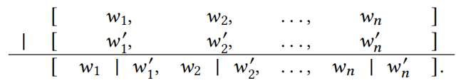
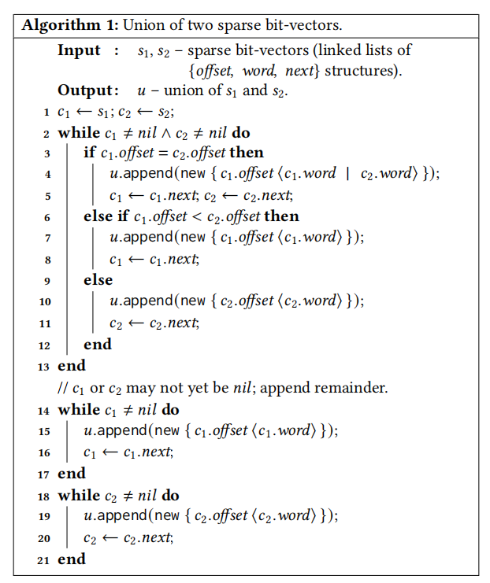
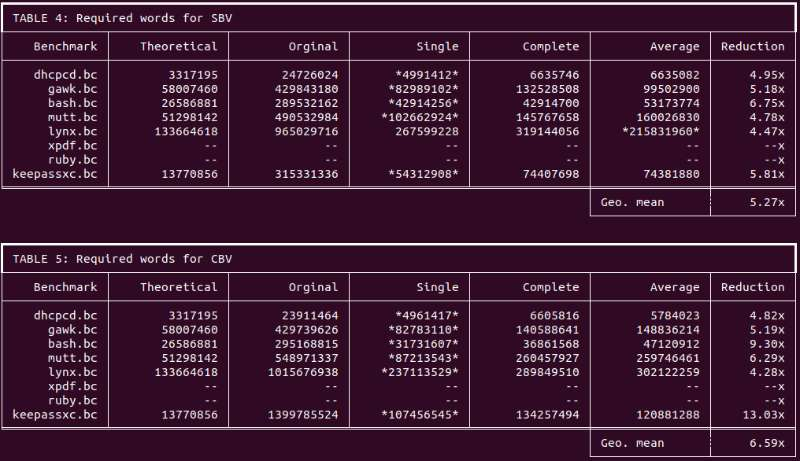
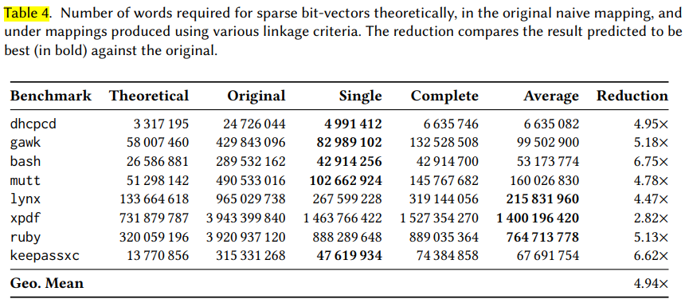
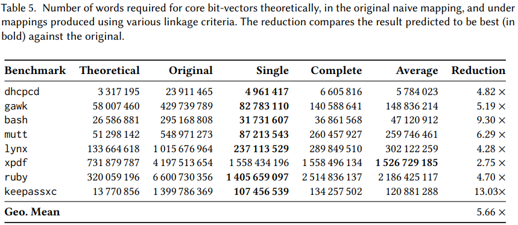
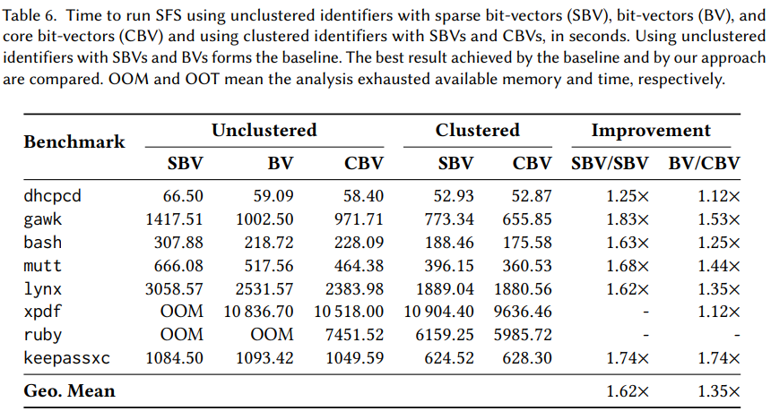
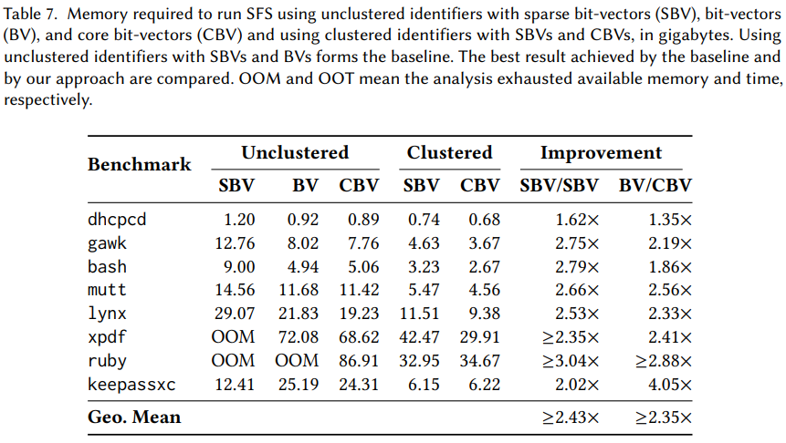
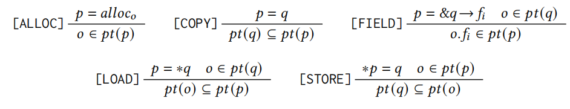
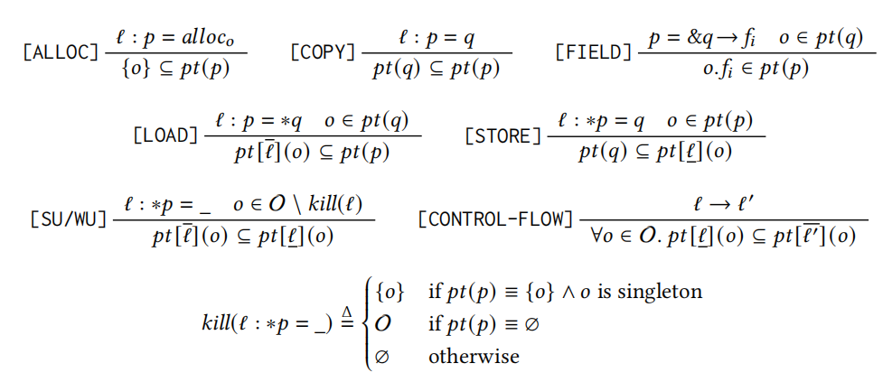
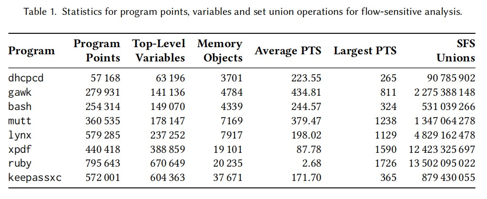

# Compacting Points-To Sets through Object Clustering论文报告

## 一. 论文概述

## 二. 论文详解

## **指向集->位向量**

### **连续和稀疏的位向量**

假设有n个对象，分别记为1，2，...，n。如果一个连续位向量要表示指向i（0 < i < n）个对象的集合。在最好的情况下，words利用率最大时，即一个word所有位被1填满才用到下一个word，这时候只需$\lceil \frac{i}{W} \rceil$个word，其中每个word有W位。最坏情况下，则需要$\lceil \frac{n}{W} \rceil$  
具体的例子：假如有10000个对象，假设为$o_0,o_1,...,o_{9999}$，有两个指针p和q，它们的指向集分别为  
$$pt(p)={o_1,o_{4500},o_{9999}}$$  
$$pt(q)={o_1,o_4,o_8}$$  
那么用位向量来表示就是   
$$pt(p)= [ ⟨01_1 00⟩, ⟨0000⟩, . . . , ⟨0000⟩, ⟨1_{4500} 000⟩, ⟨0000⟩, . . . , ⟨0000⟩, ⟨0001_{9999} ⟩ ]$$  
$$pt(q)= [ ⟨01_1 00⟩, ⟨1_4 000⟩, ⟨1_8 000⟩ ]$$    
此时word大小W为4，pt(p)达到最坏的情况使用了$\lceil \frac{n}{W} \rceil=\lceil \frac{10000}{4} \rceil$个word，最好的情况时只用$\lceil \frac{i}{W} \rceil=\lceil \frac{3}{4} \rceil$，即一个word就可以表示。而且此时pt(q)为了和pt(p)对齐以方便位运算的操作，需要在末尾填充0达到一样的尺寸，这无疑是很浪费的。  
稀疏位向量则表示成如下：  
$$pt(p)= \{ 0 ⟨01_1 00⟩ \} → \{ 4500 ⟨1_{4500} 000⟩ \} → \{ 9996 ⟨0001_{9999} ⟩ \} → nil$$  
$$pt(q)= \{ 0 ⟨01_1 00⟩ \} → \{ 4 ⟨1_4 000⟩ \} → \{ 8 ⟨1_8 000⟩ \} → nil$$  
此时多了一些偏移量的数据需要存储 ，减少了很多多余的0，pt(p)得到了极大的改善，pt(q)反而不如之前。当然，如果要满足𝑝𝑡(𝑝) ⊆ 𝑝𝑡(𝑞)的约束，之前pt(q)需要填充零，而此时不需要，所以pt(q)实际上也是有所改善。  
实际上，稀疏位向量最大的的问题并非偏移量数据占用内存，而是向量化
、空间局部性的损失和额外的操作逻辑。  
例如对于或操作中，连续位向量只需如下操作：  
  
而稀疏位向量则需要复杂的算法实现：  
  
充斥着条件（3，6行），间接引用（5，8），节点的堆分配（4）  
假设一个理想的映射：  
$$𝑜_1 → 0\quad𝑜_{4500} → 1\quad𝑜_{9999} → 2\quad𝑜_4 → 3\quad𝑜_8 → 4$$  
pt(p)和pt(q)可以表示如下  
$$pt(p)=[ ⟨1_0 1_1 1_2 0⟩ ]$$  
$$pt(q)=[ ⟨1_0 001_3 ⟩, ⟨1_4 000⟩ ]$$  
此时满足𝑝𝑡(𝑝) ⊆ 𝑝𝑡(𝑞)的约束，它们之间执行并操作（对应于word的或运算），得到结果$𝑝𝑡(𝑞) = [ ⟨1_0 1_1 1_2 1_3 ⟩, ⟨1_4 000⟩ ]$，此时就是最好的情况。  
但实际中，很难找到这样理想的映射关系。  

### **核心位向量**

核心位向量是标准位向量的一种改进形式。  
例如W=4时，假设5个对象分别映射到9995，9996，9997，9998，9999  
核心位向量则表示为：  
$$\{ 9992 [ ⟨0001_{9995} ⟩, ⟨1_{9996} 1_{9997} 1_{9998} 1_{9999} ⟩ ] \}$$  
如果插入9988，则表示为：  
$$\{ 9988 [ ⟨1_{9988} 000⟩, ⟨0001_{9995} ⟩, ⟨1_{9996} 1_{9997} 1_{9998} 1_{9999} ⟩ ] \}$$  
可以看到它使用了稀疏位向量的偏移量，相比起标准位向量完整的从头到尾写出来，核心位向量从第一个非零的word开始，到最后一个非零的word，所以相比起稀疏位向量，它中间依旧可能会有大量的为零的word。

## 三. 代码讲解  

## **代码内容**

### **1. 代码概述**
&emsp;&emsp;本论文并没有提出一个新的源代码分析框架，只是对指针分析的PointToSet的表示方式进行改进。所以本论文的代码是在SVF框架上进行一定改动，将论文内容嵌入SVF框架中，对指针分析的PointToSet部分进行了一定的改动。论文代码的ReadMe文件中提到：代码的主要改动为三个部分——CoreBitVector、NodeIDAllocator和PointsTo。后面的代码讲解就主要关注这三个部分。

### **2. CoreBitVector**
&emsp;&emsp;这部分代码包含两个代码文件CoreBitVector.h和CoreBitVector.cpp，主要内容是CoreBitVector和CoreBitVectorIterator这两个类，分别实现了CBV及其迭代器。从类的层次结构来看，CoreBitVectorIterator是CoreBitVector的内部类

(1) CoreBitVector

&emsp;&emsp;CoreBitVector类是CBV的代码实现，一个CoreBitVector对象代表一个CBV。该类对CBV的结构实现如下代码所示：
```C++
class CoreBitVector
{
    public:
    typedef unsigned long long Word;// 一个Word代表64bit

    // ......省略

    private:
    // The first bit of the first word.
    // CBV中第一个有效word(非0word)的第一个有效bit在整个CBV中的偏移量
    unsigned offset;
    // Our actual bit vector.
    // 存储第一个有效word及其之后的word
    std::vector<Word> words;
}
```
&emsp;&emsp;此外，该类实现了大部分的集合运算，如：交(&=)、并(|=)、差(-=)等，足以支持SVF框架中的指针分析。  

(2) CoreBitVectorIterator  

&emsp;&emsp;CoreBitVectorIterator类实现了CBV的迭代器，结构实现的代码如下：
```C++
class CoreBitVectorIterator
{
    //.......省略

    private:
    /// CoreBitVector we are iterating over.(当前CoreBitVector)
    const CoreBitVector *cbv;
    /// Word in words we are looking at.(当前CoreBitVector中的当前Word)
    std::vector<Word>::const_iterator wordIt;
    /// Current bit in wordIt we are looking at(当前Word中的bit偏移量)
    /// (index into *wordIt).
    unsigned bit;
};
```
&emsp;&emsp;该类实现的方法包含了基本的迭代器功能，如：解引用(*)、自增(前置/后置++)、赋值(=)等。使用该迭代器对CoreBitVector对象进行迭代，可以得到CoreBitVector对象所蕴含的CBV信息，即CBV有哪些位置被置1。

### **3. NodeIDAllocator**
&emsp;&emsp;这部分代码包含两个代码文件NodeIDAllocator.h和NodeIDAllocator.cpp，主要内容是NodeIDAllocator和Clusterer这两个类。从类的层次结构来看，Cluster是NodeIDAllocator的内部类。这部分的代码所实现的主要功能是聚类算法中的聚类以及代码运行过程中对各值、对象的编号分配。

(1) NodeIDAllocator  
&emsp;&emsp;这个类实现的是对值、对象的编号分配，根据策略不同会有不同的分配方式(DENSE、SEQ和DEBUG)，而其中有一类GepObject比较特殊，在DEBUG策略中的编号分配方式会有所变化。

(2) Cluster  
&emsp;&emsp;Cluster，顾名思义就是实现了聚类算法的类，但是在该论文提供的代码中，该类只提供在DENCE编号分配策略下的聚类。这个类实现的重要方法有：regionObjects(根据指针流向图划分有关联的对象)、getDistanceMatrix(得到聚类算法中所需要的距离矩阵，存储各节点(值或对象)间距离)、traverseDendogram(利用深度优先搜索遍历聚类树，依次得到各个叶子结点)、evaluate(评估使用不同类型PonitToSet(原始BV、离散BV等)的效果)、cluster(根据节点编号进行聚类)、getReverseNodeMapping(反映射cluster()函数的聚类结果)

### **4. PointsTo**
&emsp;&emsp;这部分代码包含两个代码文件PointsTo.h和PointsTo.cpp，包含PointsTo和PointsToIterator两个类(PointsToIterator是PointsTo的内部类)。这部分代码的主要作用就是表示一个PointToSet。总体而言这部分代码并没有太多的新内容，主要是将表示一个PointToSet所需要的内容整合起来。首先，一个PointsTo类需要确定PointToSet的类型(BV/SBV/CBV)，然后根据这个类型选择PointsTO类中用以表示BitVector的对象(暂称bv)及PointsToIterator中的迭代器(暂称It)。PointsTo中实现的各函数基本都是调用bv中对应的函数，相应地，PointsToIterator中的函数基本也是调用It的相应函数。此外，PointsTo类还会存储聚类的映射及反映射。  

## **代码运行**
### **1. 运行结果** 
  


### **2. 论文结果**
  
  
  


### **3. 结果比对与分析**  
(1) 相同  
&emsp;&emsp;比对我们的运行结果与论文给出的实验结果，可以发现在没有发生OOM(内存溢出)和OOT(超时)的情况下，两者的数据基本一致，这说明我们小组使用论文给出的代码可以基本复现出作者的实验结果。

(2) 不同  
&emsp;&emsp;在部分论文结果有数据的位置，我们的复现结果为"--"或者"OOM"，导致这种情况的原因是运行内存不足。论文的实验环境是100G的运行内存，我们小组在复现时使用的是个人电脑，只能在15G运行内存的环境下进行运行，无法分析论文中给出的一些待分析源码样例。


## 4. 见解


## 5. 成员分工  
<br>
<br>
<br>
<br>
<br>
<br>
<br>
<br>


# **后面是废案，不够字数再挑一点填上去**


## 1. CoreBitVector
这部分包含两个代码文件：CoreBitVector.h和CoreBitVector.cpp，这两个文件主要定义了两个类：CoreBitVector、CoreBitVectorIterator，分别代表CoreBitVector及其迭代器  

(1) CoreBitVector和CoreBitVectorIterator的结构实现：  

- CoreBitVector

```C++
class CoreBitVector
{
    public:
    typedef unsigned long long Word;// 一个Word代表64bit

    // ......省略

    private:
    /// The first bit of the first word.(第一个word的第一个有效bit的偏移量)
    unsigned offset;
    /// Our actual bit vector.(实际上的BitVector)
    std::vector<Word> words;
}
```
在这个类中，一个CoreBitVector可能由多个word组成，用一个类型为vector&lt;Word&gt;的words变量按Word的前后顺序进行存储。Word代表unsigned long long类型，所以一个Word代表64bit的BitVector片段。  
<font color="red">需要注意的是：</font>  每一个word是按照**从右到左**的顺序进行计数的，这个在后面分析CoreBitVectorIterator的函数时会有所体现。  
offset变量表示BitVector中第一个有效位的位置：words[0]不一定BitVector中的第一个word，若某个BitVector的前若干个word都是0，则会占用大量无用内存，此时只需记录第一个非零位在整个BitVector中的位置即可。

- CoreBitVectorIterator

```C++
class CoreBitVectorIterator
{
    //.......省略

    private:
    /// CoreBitVector we are iterating over.(当前CoreBitVector)
    const CoreBitVector *cbv;
    /// Word in words we are looking at.(当前CoreBitVector中的当前Word)
    std::vector<Word>::const_iterator wordIt;
    /// Current bit in wordIt we are looking at(当前Word中的bit偏移量)
    /// (index into *wordIt).
    unsigned bit;
};
```
CoreBitVectorIterator中包含三个变量cbv，wordIt，bit，这三个变量在三个层级进行定位从而指向当前所指向的bit。

- 示意图
  


(2) CoreBitVectorIterator的函数
 
- 构造
```C++
// Returns an iterator to the beginning of cbv if end is false, and to the end of cbv if end is true.  
// 参数end控制返回头部迭代器还是尾部迭代器 
CoreBitVectorIterator(const CoreBitVector *cbv, bool end=false): cbv(cbv), bit(0)
{
    // 根据参数返回相应的迭代器
    // 此时wordIt指向第一个word  或  最后一个word的后面
    wordIt = end ? cbv->words.end() : cbv->words.begin();

    // If user didn't request an end iterator, or words is non-empty,
    // from 0, go to the next bit. But if the 0 bit is set, we don't
    // need to because that is the first element.
    //    如果返回的是头部迭代器    且     头部word的第一位不为1
    if (wordIt != cbv->words.end() && !(cbv->words[0] & (Word)0b1)) ++(*this);// 迭代器移到第一个被设为1的位的位置(++运算符的重载后面会提到)
}

```

注意该函数中的if语句的第二个判断条件cbv->words[0] & (Word)0b1，这里体现了word内部的bit顺序是**从右往左**数：这里是判断头部word的第一位是否为1，而0b1是最右边一位为1。

- ++it运算符重载
```C++
/// Pre-increment: ++it.
const CoreBitVectorIterator &operator++(void)
{
    assert(!atEnd() && "CoreBitVectorIterator::++(pre): incrementing past end!");

    ++bit;// 在当前word中指向位的下标+1
    // Check if no more bits in wordIt. Find word with a bit set.
    // 若该word的第bit位无效(bit超出word的长度或第bit位未置位)，
    // 则寻找下一个不为0的word并将bit置为0
    if (bit == WordSize || (*wordIt >> bit) == 0)
    {
        // 找到下一个word
        bit = 0;
        ++wordIt;
        // 开始找第一个非0word直至该BitVector结束
        while (wordIt != cbv->words.end() && *wordIt == 0) ++wordIt;
    }

    // Find set bit if we're not at the end.
    if (wordIt != cbv->words.end())
    {
        // 找到该word第一个为1的位的下标
        while (bit != WordSize && (*wordIt & ((Word)0b1 << bit)) == 0) ++bit;
    }

    return *this;
}
```
此处while语句中的第二个判断条件也说明word的顺序是**从右往左**进行计数的： 
该while语句是为了找到第一个设为1的位的下标，通过将0b1**左移**对不同的位进行搜索

- *解引用运算符
```C++
/// Dereference: *it.
const unsigned operator*(void) const
{
    assert(!atEnd() && "CoreBitVectorIterator::*: dereferencing end!");
    size_t wordsIndex = wordIt - cbv->words.begin();
    // Add where the bit vector starts (offset), with the number of bits
    // in the passed words (the index encodes how many we have completely
    // passed since it is position - 1) and the bit we are up to for the
    // current word (i.e., in the n+1th)

    //  CoreBitVector的起始偏移             被指向位在当前word中的位置
    return cbv->offset + wordsIndex * WordSize + bit;// 返回该迭代器所指向位在BitVector中所代表的的位置
    //               完全横跨的word的总位数大小
}
```

(3) CoreBitVector的函数

- |=运算符重载  
集合的并运算在指针分析中具有重要作用，所以这里着重关注|=运算符，CoreBitVector通过该运算符进行并运算。  
该函数将CoreBitVector(后称本CBV)与另一CoreBitVector(后称另CBV)进行或运算，会改变本CBV的值。**若CoreBitVector的内容发生改变，则返回true，否则返回false**
```C++
bool CoreBitVector::operator|=(const CoreBitVector &rhs)
{
    // 若本CBV不包含任何word，则直接将另CBV赋值给本CBV
    if (words.size() == 0)
    {
        *this = rhs;
        // 若另CBV也不包含任何word，则本CBV没有变化
        return words.size() != 0;
    }

    // 若另CBV内容为空，则本CBV不会改变
    if (rhs.words.size() == 0) return false;

    // 本CBV与另CBV为同一个对象，本CBV不会改变
    if (this == &rhs) return false;

    // 下面两行是对本CBV和另CBV所表示范围进行适配，使两者相同
    // TODO: some redundancy in extendTo calls.
    // 另CBV的最后一位下标f_idx_2大于本CBV，则需要对本CBV进行扩展，从末尾一直到f_idx_2填充0
    if (finalBit() < rhs.finalBit()) extendForward(rhs.finalBit());
    // 本CBV的第一位下标offset大于另CBV，则需要对另CBV进行扩展，从offset开始填充0
    if (offset > rhs.offset) extendBackward(rhs.offset);

    // Start counting this where rhs starts.
    // 找到另CBV的首位偏移在本CBV的第几个word中，从而方便word的对应
    const size_t thisIndex = indexForBit(rhs.offset);
    size_t rhsIndex = 0;

    // Only need to test against rhs's size since we extended this to hold rhs.
    // 分别找到本CBV与另CBV相互对应的第一个word的指针
    Word *thisWords = &words[thisIndex];
    const Word *rhsWords = &rhs.words[rhsIndex];
    const size_t length = rhs.words.size();
    Word changed = 0;

    // Can start counting from 0 because we took the addresses of both
    // word vectors at the correct index.
    // 从另CBV的头开始向尾部遍历
    #pragma omp simd
    for (size_t i = 0 ; i < length; ++i)
    {
        const Word oldWord = thisWords[i];
        // Is there anything in rhs not in *this?
        // 更新本CBV
        thisWords[i] = thisWords[i] | rhsWords[i];
        // 新旧本CBV对比查看是否有改变
        changed |= oldWord ^ thisWords[i];
    }

    return changed;
}
```

## 2. NodeIDAllocator

# **tmp**

## **Introduction**

指向分析是一种静态程序分析，它确定每个指针在运行时可能指向的内存对象。理想情况下分析是sound和precise/complete的，实际中通常在保证soundiness的情况下提高精度。  
近年来很多方法从算法的角度去提升分析的精度，而在数据结构上往往使用bit-vectors来进行分析。  
如集合{0,3,8,9}用bit-vector表示如下：  
$$[\,\langle\,1\,0\,0\,1\,\rangle,\langle\,0\,0\,0\,0\,\rangle,\langle1\,1\,0\,0\,\rangle\,]$$
对应从左往右数第0，3，8，9位用1表示。  
相比于直接表示集合的四个元素,如用二进制表示（或其他方法）：$\langle\,0\,0\,0\,0\,\rangle$,$\langle\,0\,0\,1\,1\,\rangle$,$\langle\,1\,0\,0\,0\,\rangle$,$\langle\,1\,0\,0\,1\,\rangle$,bit-vector只用了三个word表示。  
但是在指向分析中，bit-vector经常会有冗余的0，如上面例子中的第二个word。如果指向集合是{2,5000}，那么冗余的零会更多。  
稀疏位向量通过省略非零word，用链表连接这些非零的word并加上偏移量来表示，如：  
$$\{\,0\,\langle\,1\,0\,0\,1\,\rangle\}->\{\,8\,\langle\,1\,1\,0\,0\,\rangle\}\rightarrow nil$$  
但这种方法损失了空间局部性和向量化的机会，连接和偏移量也增加了额外的数据。  
可见位向量和稀疏位向量的数据结构存在缺陷，本文希望找到改进的方法来减少多余的0的数量。

## **背景和动机**

### **基于包含的指向分析**

此类分析通常被形式化为一组推理规则，这些推理规则基于各种程序语句在指向集之间生成约束。通过执行集合联合来求解约束，直到达到一个固定点。  
本文的方法用C/C++的指向分析来进行评估，在类LLVm的指令集上执行分析。其中所有变量的集合$V=O\cup P$,其中$O$是所有可能的抽象对象和它们的域的集合，$P$是所有栈和全局指针（顶级指针）的集合，顶级指针是显式的（通过地址获取变量是隐式的），通过顶级指针可以直接使用存储和加载指令。  
给定 𝑝, 𝑞 ∈ P 和 𝑜 ∈ O，有五条基本指令：  
- $Alloc: 𝑝 = 𝑎𝑙𝑙𝑜𝑐_𝑜$
  - 即内存分配（内存抽象为一个内存对象𝑜）
- $Copy: 𝑝 = 𝑞$
  - 两个顶级指针之间的赋值
- $Field: 𝑝 = \&𝑞→𝑓_𝑖$ 
  - 对q所指向对象的第i个域$𝑓_𝑖$的访问
- $Load: 𝑝 = *𝑞$
  - 表示来自解引用指针的赋值
- $Store: ∗𝑝 = 𝑞$
  - 对解引用指针的赋值

图一展示了域敏感和流不敏感的指向分析的推理规则

<center>
    
    <br>
    <div >图一</div>
</center>

除了alloc和field指令，每条指令通过求解两点间的集合约束来分析集合。例如：𝑝𝑡(𝑞) ⊆ 𝑝𝑡(𝑝)，表示𝑝𝑡(𝑞)包含于𝑝𝑡(𝑝)。  
指向集的大小单调增加直至不动点。在迭代约束求解的过程中，load和store指令可以基于解引用指针而新发现的指向目标得到更多并集。一个越精确的分析意味着更多的并集操作。  
图二给出了传统的基于包含的流敏感的分析的规则。

<center>
    
    <br>
    <div >图二</div>
</center>

流不敏感的分析为每个变量仅计算单个指向集结果，流敏感分析则通过计算和维持每个对象𝑜在每条指令ℓ前和后的指向集（ 𝑝𝑡[ℓ] (𝑜) 和 𝑝𝑡[ℓ] (𝑜) ）来保证更精确的指向结果。大大增加了指向集的数量和集合约束。  
注意到我们不需要将一个程序点和顶级指针联系起来，因为它们在LLVM的部分SSA形式中只会被定义一次（？？？）  
另一个精确度的来源是带着kill函数的[SU/WU]指令，提供了单例对象的标准强大更新（？？？）  
最后，通过[CONTROL-FLOW]指令，内存对象的指向集得以在CFG上通过控制流edge$(ℓ → ℓ^{'})$传播，因此引入了更多并集操作，这是流不敏感分析所不具备的。  
最先进的流敏感分析分阶段来进行，它构建一个def-use图，def-use图是CFG上数据流构建的一种稀疏表示。然后就在CFG上通过构建的def-use边而不是控制流边来传播指向集。该方法使用了不太精确但成本低的辅助分析（如Andersen分析），过度估计更精确的流敏感分析来引导该分析。（？？？bootstrap main指主流？）  
主要见解是辅助分析的指向集总是更保守（即辅助分析的指向集是主分析的指向集的父集）。辅助分析得到的结果可以用于确定主分析的属性，如sound def-use图。尽管是逐步进行的，越来越精确的分析所需的并集操作和存储指向集的增加仍然是非常昂贵的。对于流敏感分析，主分析比流不敏感的分析慢，但是比不分级的流敏感分析快。  

### **并集操作的流行**

并集操作是整个程序指向分析的关键，其花费的时间取决于程序的大小和分析的精度。一个较大的程序通常包含更多的对象和有更大更多的指向集，导致一次并集操作的开销更大，次数也更多。。更精确的分析有更多的并集操作，例如流敏感分析对每个程序点计算指向集，而流不敏感只对每个变量计算单个结果。  
本文通过分析运行一个流敏感的包含分析说明上面这一点。该分析在SVF上实现流不敏感的Andersen分析阶段运行，运行在8个开源程序并记录在主阶段所需的并集数量。程序覆盖广泛领域，包括邮件，程序语言和密码管理。具体细节在第5节。表1展示了程序点，顶级指针和抽象内存对象的数量。  

<center>
    
    <br>
    <div >表一</div>
</center>

从表一可以看出数据量很大，所以任何改进都可能取得巨大成效。