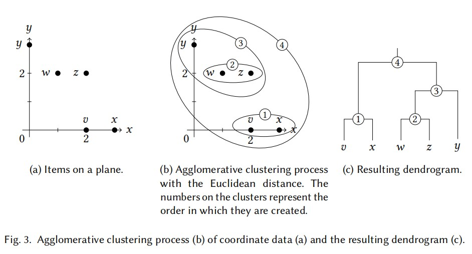
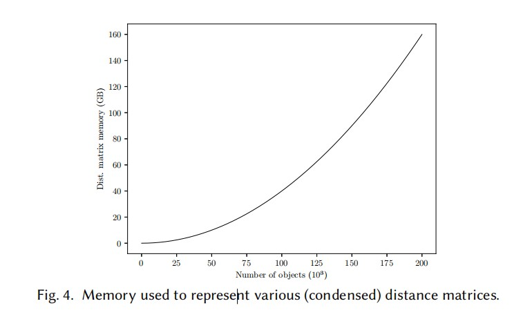
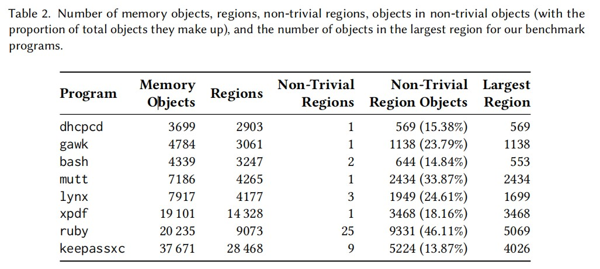

## Compacting Points-To Sets through Object Clustering论文报告
<p align="right"><font face="楷体" size=5 align="right">20331021李应东  20331011范兆基</font></P>

[原文地址](https://zenodo.org/record/5507442#.Y3xgOklBwQ8)  
## 一. 论文概述
&emsp;&emsp;针对指针分析，本论文提出了新的指向集表示方式核位向量，减少了表示指向集的内存消耗。该论文还将压缩指向集建模成一个整数规划问题，并利用层级聚类、基于区域聚类和对齐word的标识符映射进以减少指针分析过程所需的空间与时间。
## 二. 论文详解

## **1. 指向集->位向量**

### **(1) 连续和稀疏的位向量**
&emsp;&emsp;假设有n个对象，分别记为1，2，...，n。如果一个连续位向量要表示指向i（0 < i < n）个对象的集合。在最好的情况下，words利用率最大时，即一个word所有位被1填满才用到下一个word，这时候只需$\lceil \frac{i}{W} \rceil$个word，其中每个word有W位。最坏情况下，则需要$\lceil \frac{n}{W} \rceil$  
&emsp;&emsp;具体的例子：假如有10000个对象，假设为$o_0,o_1,...,o_{9999}$，有两个指针p和q，它们的指向集分别为  
$$pt(p)={o_1,o_{4500},o_{9999}}$$  
$$pt(q)={o_1,o_4,o_8}$$  
&emsp;&emsp;那么用位向量来表示就是   
$$pt(p)= [ ⟨01_1 00⟩, ⟨0000⟩, . . . , ⟨0000⟩, ⟨1_{4500} 000⟩, ⟨0000⟩, . . . , ⟨0000⟩, ⟨0001_{9999} ⟩ ]$$  
$$pt(q)= [ ⟨01_1 00⟩, ⟨1_4 000⟩, ⟨1_8 000⟩ ]$$    
&emsp;&emsp;此时word大小W为4，pt(p)达到最坏的情况使用了$\lceil \frac{n}{W} \rceil=\lceil \frac{10000}{4} \rceil$个word，最好的情况时只用$\lceil \frac{i}{W} \rceil=\lceil \frac{3}{4} \rceil$，即一个word就可以表示。而且此时pt(q)为了和pt(p)对齐以方便位运算的操作，需要在末尾填充0达到一样的尺寸，这无疑是很浪费的。  
&emsp;&emsp;稀疏位向量则表示成如下：  
$$pt(p)= \{ 0 ⟨01_1 00⟩ \} → \{ 4500 ⟨1_{4500} 000⟩ \} → \{ 9996 ⟨0001_{9999} ⟩ \} → nil$$  
$$pt(q)= \{ 0 ⟨01_1 00⟩ \} → \{ 4 ⟨1_4 000⟩ \} → \{ 8 ⟨1_8 000⟩ \} → nil$$  
&emsp;&emsp;此时多了一些偏移量的数据需要存储 ，减少了很多多余的0，pt(p)得到了极大的改善，pt(q)反而不如之前。当然，如果要满足𝑝𝑡(𝑝) ⊆ 𝑝𝑡(𝑞)的约束，之前pt(q)需要填充零，而此时不需要，所以pt(q)实际上也是有所改善。  
实际上，稀疏位向量最大的的问题并非偏移量数据占用内存，而是向量化
、空间局部性的损失和额外的操作逻辑。  
例如对于或操作中，连续位向量只需如下操作：  
<center>
    
    <br>
</center>

&emsp;&emsp;而稀疏位向量则需要复杂的算法实现：
<center>
    
    <br>
    <div >图二</div>
</center>
  

&emsp;&emsp;假设一个理想的映射：  
$$𝑜_1 → 0\quad𝑜_{4500} → 1\quad𝑜_{9999} → 2\quad𝑜_4 → 3\quad𝑜_8 → 4$$  
&emsp;&emsp;pt(p)和pt(q)可以表示如下  
$$pt(p)=[ ⟨1_0 1_1 1_2 0⟩ ]$$  
$$pt(q)=[ ⟨1_0 001_3 ⟩, ⟨1_4 000⟩ ]$$  
&emsp;&emsp;此时满足𝑝𝑡(𝑝) ⊆ 𝑝𝑡(𝑞)的约束，它们之间执行并操作（对应于word的或运算），得到结果$𝑝𝑡(𝑞) = [ ⟨1_0 1_1 1_2 1_3 ⟩, ⟨1_4 000⟩ ]$，此时就是最好的情况。  但实际中，很难找到这样理想的映射关系。  

### **(2) 核位向量**

&emsp;&emsp;核位向量是标准位向量的一种改进形式。  
&emsp;&emsp;例如W=4时，假设5个对象分别映射到9995，9996，9997，9998，9999  
&emsp;&emsp;核位向量则表示为：  
$$\{ 9992 [ ⟨0001_{9995} ⟩, ⟨1_{9996} 1_{9997} 1_{9998} 1_{9999} ⟩ ] \}$$  
&emsp;&emsp;如果插入9988，则表示为：  
$$\{ 9988 [ ⟨1_{9988} 000⟩, ⟨0001_{9995} ⟩, ⟨1_{9996} 1_{9997} 1_{9998} 1_{9999} ⟩ ] \}$$  
&emsp;&emsp;可以看到它使用了稀疏位向量的偏移量，相比起标准位向量完整的从头到尾写出来，核位向量从第一个非零的word开始，到最后一个非零的word，所以相比起稀疏位向量，它中间依旧可能会有大量的为零的word。


## **2. 压缩指向集**
&emsp;&emsp;这部分内容主要是：将压缩指向集问题定义为一个整数规划问题及该问题的解决方法。
### **(1) 定义整数规划问题**
&emsp;&emsp;我们无法事先预知一个好的对象->标识符映射，论文中使用辅助分析来预估哪些对象将会在同一个指向集中，这种方法的预估结果是主要分析的结果的超集(over-approximate)。因此，为辅助分析创建映射有助于为主要分析创建一个良好的映射(原文：至少比随机映射要好)。  
&emsp;&emsp;定义整数规划问题的符号、公式较多，所以这部分需要较大的篇幅，且后续变量都是整数。  
&emsp;&emsp;符号定义：  
&emsp;&emsp;&emsp;&emsp;已知变量：
$$W：word的bit位数量$$ 
$$P=\{o_{x_1},o_{x_2},o_{x_3},...,o_{x_n} \}：辅助分析得到的指向集$$
$$n：指向集P中的对象数目$$
$$w=\lceil\frac{n}{W}\rceil：在最优情况(标识符最大程度不分散)下用位向量表示P所需的最少word数量$$
&emsp;&emsp;&emsp;&emsp;未知变量：
$$m_{ x_{i} }：对象o_{ x_{i} }所映射到的标识符, 1 \leq i \leq n$$
$$f：m_{ x_{i} }起始偏移值的乘数基数$$
&emsp;&emsp;压缩指向集的目标是使映射后的标识符尽可能地靠近以节约空间(位向量更小)与时间(并运算更简单)，论文中使用核位向量作为例子，进行后面的分析。  
&emsp;&emsp;在最优情况下，P中对象的标识符满足以下约束：
$$ \frac{|m_{ x_{i} } - m_{ x_{j} }|}{W}  < w, 1 \leq i,j \leq n且最小的m_{ x_{i} }分配为f*W$$  
&emsp;&emsp;此处将首个标识符对齐W的原因是尽可能避免标识符跨越边界。例：W=4，pt={ $o_{1}$, $o_{2}$ }。若按照如下分配：$o_{1}$->7, $o_{2}$->8，此时需要2个word。若进行对齐：$o_{1}$->0, $o_{2}$->1,此时只需要1个word。两种情况都满足 $\frac{|m_{ x_{i} } - m_{ x_{j} }|}{W}  < w$，但是后者更优。  
&emsp;&emsp;该部分定义的整数规划问题的目的是求出最优的m(标识符)和f(乘数基数)，论文按照渐进的方式得到最终的整数规划问题。  

&emsp;&emsp;**限制C1**：只需要指向集中所有对象被分配的标识符大于起始偏移且只需要理想化最小的word数目。
$$ m_{ x_{i} } \geq f_{p} \cdot W$$
$$ m_{ x_{i} } < f_{p} \cdot W +w_{p} \cdot W$$
$$ f_{p} \geq 0$$

&emsp;&emsp;**限制C2**：不同对象不能映射到同一个标识符。  
&emsp;&emsp;&emsp;&emsp;形式一：
$$ m_{ x_{i} } - m_{ x_{j} } > 0 $$
&emsp;&emsp;&emsp;&emsp;形式二：
$$ m_{ x_{i} } - m_{ x_{j} } < L \cdot b_{ij}$$
$$ m_{ x_{i} } - m_{ x_{j} } > -L + L \cdot b_{ij}$$
$$ b_{ij} \geq 0$$
$$ b_{ij} \leq 0$$  
&emsp;&emsp;&emsp;&emsp;&emsp;&emsp;该形式的约束通过$b_{ij}=0$与$b_{ij}=1$的分类讨论可以较好理解
<br>
&emsp;&emsp;仅仅C1/C2两个约束会出现鸽巢原理的问题：
&emsp;&emsp;假设有W个指向集，每个指向集都有一个共同元素o(标识符为m，在w个word钟)，然后每个指向集还有一个独一无二的对象。在这种情况下，总共有(W+1)个对象，一个word(大小为W)无法表示。考虑(W-1)个指向集，则一个word正好可以表示。多出来的第W个指向集的唯一对象最好是分配在第(w-1)或(w+1)个word中。  

&emsp;&emsp;**限制C3**：论文中的解决方法是为每个指向集引入容忍值去拓展标识符的范围，同时为每个指向集引入一个未知变量 t, 衡量拓展范围的大小。
$$ m_{ x_{i} } \geq f_{p} \cdot W$$
$$ m_{ x_{i} } < f_{p} \cdot W +w_{p} \cdot + W + t_{p} \cdot W$$
$$ f_{p} \geq 0$$
$$ t \geq 0$$
&emsp;&emsp;容易发现 C3 是 C1 的改进版，但是容忍度不可过大，否则就违背了精简指向集的初衷。所以规划问题的另一目标就是最小化 $t_{1}+t_{2}+t_{3}+...t_{n}$
&emsp;&emsp;总结起来就是：对每个指向集P，在最优情况为使用$w_{p}$个word的前提下，将指向集P表示为核位向量。上述限制限定了一个使指向集适用于$w_{p}$个word的标识符映射，但是允许对word有一定的容忍度。最小化容忍乘数($t_{1}+t_{2}+t_{3}+...t_{n}$ )的优化用以保证使用尽可能少的word表示指向集，从而得到理想的标识符映射。
&emsp;&emsp;实际上这个整数规划问题的求解十分复杂，只有为数不多的方法可以简化该问题的求解，其中之一就是后续提到的用于优化聚类的分区，将所有对象划分成不同的群组单独考虑。使用整数规划求解指向集压缩问题不能与当前用于大型程序的技术相提并论。后续的内容关注更粗略但适配性更强的方法。


### **(2) 层级聚类**
&emsp;&emsp;我们的目标是将有关联的被指向对象（比如出现在同一指向集的）分配相近的数字标识符，通过层级聚类来实现这一目标。本文使用自底向上的聚类方式，即一开始有若干个单对象簇，然后根据距离最近的原则不断聚合成簇，直至只剩一个簇。  
&emsp;&emsp;例如：  
<center>
    
    <br>
</center>
&emsp;&emsp;在这个例子中，根据坐标的欧式距离，按图(b)序号先后聚合，得到最终一个簇④，同时得到图(c)这样的层次结构。  
&emsp;&emsp;有三种连接标准来判断是否在簇之间做聚合操作：  
- 单连接：通过两个簇内的最近的对象间的距离来判断，例如图(b)中聚合3时计算w和y的距离
- 完全连接：同上相反，找最远距离，例如图(b)中聚合3时计算z和y的距离  
- 平均连接：$\frac{1}{|C_1||C_2|}\sum\limits_{o_1\in{C_1}}\sum\limits_{o_2\in{C_2}}d(o_1,o_2) $，例如图(c)中聚合3时计算w和z连线中点到y的距离    

&emsp;&emsp;聚类在本论文的数据上运行得非常快，所以论文在三种标准上都进行测试，最后选出可能得到理想映射的聚类结果。

### **(3) 聚类对象**
&emsp;&emsp;想在具体在指向的对象上实现聚类，首先要知道如何定义两个对象之间的距离，就好像上面图三的例子，坐标上的点间的距离可以用欧式距离来衡量。  
&emsp;&emsp;(论文中)对象间的距离：同时包含这两个对象的指向集的最小word数。  
&emsp;&emsp;比如，考虑指向集$\{𝑜_𝑎, 𝑜_𝑏, 𝑜_𝑐, 𝑜_𝑑, 𝑜_𝑒, 𝑜_𝑓\}$和$\{𝑜_𝑎, 𝑜_𝑓 \}$，如果我们逐一扫描这两个指向集，可能得到这样的映射：  
$$𝑜_𝑎 → 0\quad 𝑜_𝑏 → 1\quad 𝑜_𝑐 → 2\quad 𝑜_𝑑 → 3\quad 𝑜_𝑒 → 4\quad 𝑜_𝑓 → 5$$   
&emsp;&emsp;此时第一个指向集会用两个word来表示，这是理想的，但是后一个指向集也需要两个word来表示，但实际只需要一个word就可以。如果我们根据上述距离的定义，可以得到d($o_a,o_f$)=min(2,1)=1，$o_a$与其他对象的距离为2，$o_f$与其他对象距离为∞，那么$o_a$和$o_f$距离最近，应分配更近的数字标识符，此时的映射可能如下：  
$$𝑜_𝑎 → 0\quad 𝑜_f → 1\quad 𝑜_b → 2\quad 𝑜_c → 3\quad 𝑜_d → 4\quad 𝑜_e → 5$$    
&emsp;&emsp;这时第一个指向集的word数仍为2，而后一个的word数则为1了，达到最理想情况。通过这个定义，我们就可以建立一个距离矩阵来进行聚类操作。矩阵元素先初始化为无穷，然后扫描每一个指向集来更新矩阵数据，得到距离矩阵。  
&emsp;&emsp;有了距离矩阵就可以进行聚类，得到树状图。在树状图上进行深度优先搜索得到的对象就是最邻近的对象。深搜得到的叶结点顺序配合从零开始的计数器分配标识符以实现对象→标识符映射。

### **(4) 基于区域的聚类**
&emsp;&emsp;距离矩阵是对称矩阵，所以可以压缩成上三角矩阵(不包含对角线)，但矩阵元素为$\frac{n(n-1)}{2}$，内存会随着元素的增加呈二次增长，如下图：  
<center>
    
    <br>
</center>
&emsp;&emsp;为了减少内存消耗，我们将对象分组到独立的区域，在不牺牲精度的情况下对每个区域进行聚类。能够实现这点是因为许多对象之间没有任何联系，它们从未出现在同一指向集中，所以无论它们的标识符离得多远都不会有不利影响。  
&emsp;&emsp;具体做法就是：建立一个无向图，在出现于同一指向集的对象间加上边，同一连通分支划分为一个区域，对每个区域分别进行聚类，此时标识符的计数器为上一区域结束时的标识符。这样多了很多距离矩阵，但这些距离矩阵所占内存之和是比之前一整个距离矩阵的内存要小的，比如n个对象均分为两个区域，此时两个矩阵元素总数为$\frac{\frac{n}{2}(\frac{n}{2}-1)}{2}*2=\frac{n(\frac{n}{2}-1)}{2}$，一个矩阵时则为$\frac{n(n-1)}{2}$，前者更小。此时我们不会对多个区域并发进行聚类，因为每个距离矩阵在完成聚类，分配好标识符后便可以释放，因此顺序执行聚类更节约内存。  
&emsp;&emsp;部分区域的对象小于W，该区域只需分配一个word，无需聚类操作来分析它们的邻近关系，直接分配任意标识符即可，文中称这些区域为琐碎区域。  
<center>
    
    <br>
</center>
&emsp;&emsp;如图，在本论文的测试样例中，可以看出琐碎区域占了占比较大，这将大大减少了聚类操作的工作负载。  

### **(5) 对齐word的标识符映射**
&emsp;&emsp;对于每一个区域，该区域内的标识符映射从W(word的大小）的整数倍开始计数。这样可以尽量减少每一个区域进行标识符分配后各指向集所用的word数量。
&emsp;&emsp;考虑如下例子(虽然此处以琐碎区域举例，但是结论可以拓展至至非琐碎区域)：有两个rgion$R_1$(包含$o_a,o_b,o_c$)和$R_2$(包含$o_d,o_e,o_f$)，W = 4
&emsp;&emsp;不对齐word的情况：两个区域的标识符分配分别为$R_1: o_a→0,o_b→1,o_c→2$ 和 $R_2: o_d→3,o_e→4,o_f→5$。包含$R_1$中对象的指向集可以表示为$\{0[⟨\times\times\times1⟩]\}$，即$\{o_a,o_b,o_c\}$的非空子集，其中$\times$代表0或1。同理，包含$R_2$中对象的指向集具有以下三种形式：
$$\{0[⟨0001⟩]\} <==> \{o_d\}$$
$$\{4[⟨\times\times01⟩]\}<==>\{o_c\}、\{o_d\}、\{o_c,o_d\}$$
$$\{0[⟨0001⟩,⟨\times\times01⟩]\}<==>\{o_d,o_e\},\{o_d,o_f\},\{o_d,o_e,o_f\}$$
&emsp;&emsp;对于包含$R_2$中对象的指向集的第三种形式，原本只需要1个word即可，但是现在却需要2个word。导致这样的原因是：不存在同时包含$R_1$中对象和$R_2$中对象的指向集，但这两个区域却共享了word，这样就会存在区域并非是最好地利用word。
&emsp;&emsp;对齐的情况：两个区域的标识符分配分别为$R_1: o_a→0,o_b→1,o_c→2$ 和 $R_2: o_d→4,o_e→5,o_f→6$。此时$R_2$的标识符分配按照W (W = 4) 进行了对齐，包含$R_2$中对象的指向集就只有一种形式$\{4[⟨\times\times\times11⟩]\}$，$R_2$只需要一个word即可，各指向集只需要使用理论上最少的word数目，优于不对齐的分配方式。
&emsp;&emsp;对齐word的标识符映射会使位向量中留下间隙，比如上述例子中的3号位就没有被使用。但是这个空缺无关紧要，因为指向集只会包含它所属区域内的对象，这个空缺是多出来的，不会被用到。更进一步地说，由于对齐而导致的核向量开头的多余的0也无关紧要。虽然改论文是在辅助分析的结果下进行聚类，但主阶段分析生成的指向集是辅助分析生成的指向集的子类，主阶段分析中的区域不会大于辅助分析中的，所以空缺的不重要性也可以适用于至主阶段分析。

## **3. 评估**

### **(1) 实现**
&emsp;&emsp;论文已在SVF框架下使用fastcluster实现了上述方法，其中稀疏位向量用LLVM中的实现，使用STL向量实现核位向量，标准位向量对应核位向量偏移量为零的情况。更多内容看后面代码讲解部分，下面对评估效果略作介绍。  


### **(2) Benchmark**
本文使用了8个基准程序做实验，具体信息如下：  
<center>
    
    <br>
</center>

### **(3) 实验效果**
&emsp;&emsp;表四展示了使用稀疏位向量时，分别在理想条件下，原始映射下，和本文方法在三个连接标准下所需的word数，可以看出本文方法不一定总在同一标准下表现最优，但是三个标准下都优于原始情况，而三个标准的最少word数仅在理想条件的1~3倍左右。  
<center>
    
    <br>
</center>
<br>
&emsp;&emsp;表五则是使用核位向量的情况，可以看到和表四类似的结论。   
<center>
    
    <br>
</center> 
<br>
&emsp;&emsp;表六为使用稀疏位向量(SBV)、标准位向量(BV)和核位向量(CBV)分别在非聚合和聚合情况下运行SFS的时间，单位为秒。OOM和OOT分别表示分析耗尽的可用内存和时间。可以看到相同条件下，使用了本文方法的时间都缩短了，OOM的情况也消失。    
<center>
    
    <br>
</center>
<br>
&emsp;&emsp;表七与表六为同一实验，不过记录的是内存。同样可以看到改进，并且OOM的情况消失。  
<center>
    
    <br>
</center> 


## 三. 代码讲解  

## **1. 代码内容**

### **(1) 代码概述**
&emsp;&emsp;本论文并没有提出一个新的源代码分析框架，只是对指针分析的PointToSet的表示方式进行改进。所以本论文的代码是在SVF框架上进行一定改动，将论文内容嵌入SVF框架中，对指针分析的PointToSet部分进行了一定的改动。论文代码的ReadMe文件中提到：代码的主要改动为三个部分——CoreBitVector、NodeIDAllocator和PointsTo。后面的代码讲解就主要关注这三个部分。

### **(2) CoreBitVector**
&emsp;&emsp;这部分代码包含两个代码文件CoreBitVector.h和CoreBitVector.cpp，主要内容是CoreBitVector和CoreBitVectorIterator这两个类，分别实现了CBV及其迭代器。从类的层次结构来看，CoreBitVectorIterator是CoreBitVector的内部类

**① CoreBitVector**

&emsp;&emsp;CoreBitVector类是CBV的代码实现，一个CoreBitVector对象代表一个CBV。该类对CBV的结构实现如下代码所示：
```C++
class CoreBitVector
{
    public:
    typedef unsigned long long Word;// 一个Word代表64bit

    // ......省略

    private:
    // The first bit of the first word.
    // CBV中第一个有效word(非0word)的第一个有效bit在整个CBV中的偏移量
    unsigned offset;
    // Our actual bit vector.
    // 存储第一个有效word及其之后的word
    std::vector<Word> words;
}
```
&emsp;&emsp;此外，该类实现了大部分的集合运算，如：交(&=)、并(|=)、差(-=)等，足以支持SVF框架中的指针分析。  

**② CoreBitVectorIterator**

&emsp;&emsp;CoreBitVectorIterator类实现了CBV的迭代器，结构实现的代码如下：
```C++
class CoreBitVectorIterator
{
    //.......省略

    private:
    /// CoreBitVector we are iterating over.(当前CoreBitVector)
    const CoreBitVector *cbv;
    /// Word in words we are looking at.(当前CoreBitVector中的当前Word)
    std::vector<Word>::const_iterator wordIt;
    /// Current bit in wordIt we are looking at(当前Word中的bit偏移量)
    /// (index into *wordIt).
    unsigned bit;
};
```
&emsp;&emsp;该类实现的方法包含了基本的迭代器功能，如：解引用(*)、自增(前置/后置++)、赋值(=)等。使用该迭代器对CoreBitVector对象进行迭代，可以得到CoreBitVector对象所蕴含的CBV信息，即CBV有哪些位置被置1。

### **(3) NodeIDAllocator**
&emsp;&emsp;这部分代码包含两个代码文件NodeIDAllocator.h和NodeIDAllocator.cpp，主要内容是NodeIDAllocator和Clusterer这两个类。从类的层次结构来看，Cluster是NodeIDAllocator的内部类。这部分的代码所实现的主要功能是聚类算法中的聚类以及代码运行过程中对各值、对象的标识符分配。

**① NodeIDAllocator**
&emsp;&emsp;这个类实现的是对值、对象的标识符分配，根据策略不同会有不同的分配方式(DENSE、SEQ和DEBUG)，而其中有一类GepObject比较特殊，在DEBUG策略中标识符分配方式会有所变化。

**② Cluster**
&emsp;&emsp;Cluster，顾名思义就是实现了聚类算法的类，但是在该论文提供的代码中，该类只提供在DENCE标识符分配策略下的聚类。这个类实现的重要方法有：regionObjects(根据辅助分析建立的无向图划分有关联的对象)、getDistanceMatrix(得到聚类算法中所需要的距离矩阵，存储各节点(值或对象)间距离)、traverseDendogram(利用深度优先搜索遍历聚类树，依次得到各个叶子结点)、evaluate(评估使用不同类型PonitToSet(原始BV、离散BV等)的效果)、cluster(根据节点标识符进行聚类)、getReverseNodeMapping(反映射cluster()函数的聚类结果)

### **(4) PointsTo**
&emsp;&emsp;这部分代码包含两个代码文件PointsTo.h和PointsTo.cpp，包含PointsTo和PointsToIterator两个类(PointsToIterator是PointsTo的内部类)。这部分代码的主要作用就是表示一个PointToSet。总体而言这部分代码并没有太多的新内容，主要是将表示一个PointToSet所需要的内容整合起来。首先，一个PointsTo类需要确定PointToSet的类型(BV/SBV/CBV)，然后根据这个类型选择PointsTO类中用以表示BitVector的对象(暂称bv)及PointsToIterator中的迭代器(暂称It)。PointsTo中实现的各函数基本都是调用bv中对应的函数，相应地，PointsToIterator中的函数基本也是调用It的相应函数。此外，PointsTo类还会存储聚类的映射及反映射。  

## **2. 代码运行**
### **(1) 运行结果** 
<center>
    
    <br>
</center>
<center>
    
    <br>
</center>

### **(2)论文结果**
<center>
    
    <br>
</center>
<center>
    
    <br>
</center>
<center>
    
    <br>
</center>
<center>
    
    <br>
</center>


### **(3) 结果比对与分析**  
(1) 相同  
&emsp;&emsp;比对我们的运行结果与论文给出的实验结果，可以发现在没有发生OOM(内存溢出)和OOT(超时)的情况下，两者的数据基本一致，这说明我们小组使用论文给出的代码可以基本复现出作者的实验结果。

(2) 不同  
&emsp;&emsp;在部分论文结果有数据的位置，我们的复现结果为"--"或者"OOM"，导致这种情况的原因是运行内存不足。论文的实验环境是100G的运行内存，我们小组在复现时使用的是个人电脑，只能在15G运行内存的环境下进行运行，无法分析论文中给出的一些待分析源码样例。


## 四. 论文见解
&emsp;&emsp;该论文提出了新形式的位向量核位向量及其对应的优化方法。我们小组认为该论文提出的核位向量可以应用于其他很多地方。一些原本使用位向量的地方都可以尝试一下使用该论文的内容，特别是位向量比较稀疏且数量较大的情况，从而减少内存消耗。


## 五. 成员分工  
#### &emsp;&emsp;各小组成员均参与该报告的所有部分且贡献相同。
